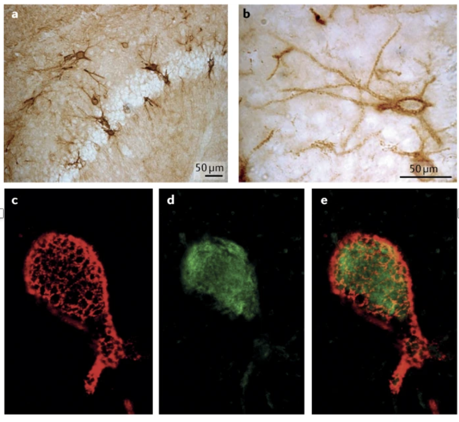

# spatialDLPFC_SCZ

JHPCE location: `/dcs04/lieber/marmaypag/spatialDLPFC_SCZ_LIBD4100`

Goal: Study spatial gene expression of perineuronal nets in DLPFC of neurotypical control and schizophrenia donors.

Background:
https://www.sciencedirect.com/science/article/pii/S092099641500002X?via%3Dihub
https://www.frontiersin.org/articles/10.3389/fnmol.2018.00270/full
https://www.nature.com/articles/s41583-019-0196-3
https://pubmed.ncbi.nlm.nih.gov/34072323/

