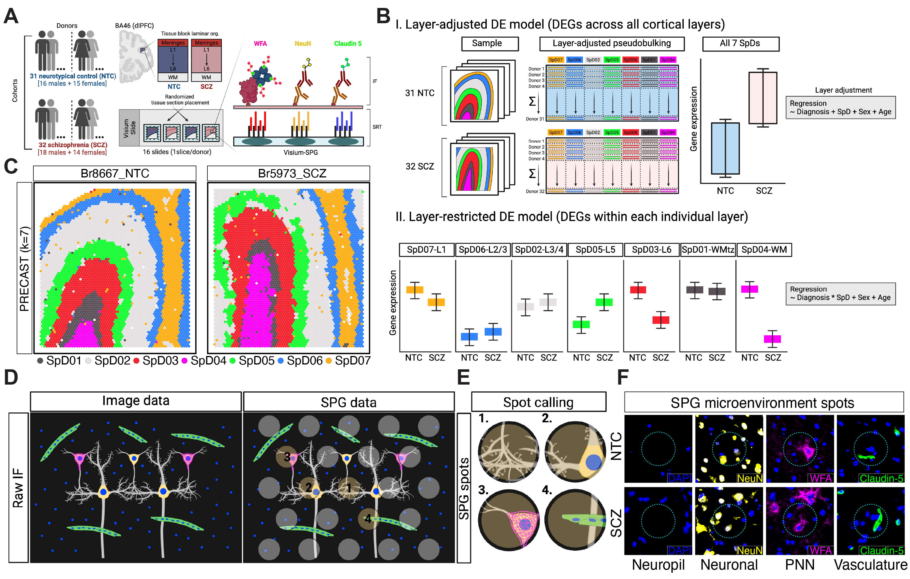

# spatialDLPFC_SCZ

## Goal: Study spatial gene expression of perineuronal nets in DLPFC of neurotypical control and schizophrenia donors.

  

## Study Design  

Molecular mechanisms underlying dorsolateral prefrontal cortex (dlPFC) dysfunction in schizophrenia (SCZ) are poorly understood. dlPFC cell types are spatially organized across the six layers into functional microcircuits, which regulate cognitive and emotional processes that are implicated in SCZ. While regional specificity across cortical layers and cell types has been demonstrated for some SCZ-linked genes, spatially-resolved transcriptomics (SRT) can more definitively map molecular associations of disease. We investigated spatial gene expression changes in the human dlPFC from neurotypical control (n=31) and SCZ (n=32) brain donors using the Visium platform with incorporation of immunostaining to label perineuronal nets, neurons and vasculature. SCZ-associated DEGs were then mapped across these labeled cellular microenvironments and cortical layers. Major transcriptional alterations were identified in synaptic and neuroimmune pathways, which we localized to neuropil and glia-enriched domains. Integrative analysis with bulk and single-cell RNA studies highlighted distinct roles for spatially-localized glial cell populations, and identified enrichment of novel DEGs in endothelial cells and microglia. These findings were supported by enrichment of SCZ genetic risk across similar domains, and association of laminae-specific transcription factors to SCZ risk variants. Cellular resolution SRT using Xenium extended laminar disease associations to spatially-organized cell types. The findings highlight unique advantages of SRT to identify novel SCZ-related biology, particularly for cellular populations and compartments that may be missed with alternative technologies. We provide data resources to enable sample-level visualization of the spatial transcriptomics data (Samui) and to explore SCZ-associated DEGs across spatial domains (iSEE-layer adjusted) and cellular microenvironments (iSEE-Neuropil, iSEE-Neuron, iSEE-vasculature, iSEE-PNNs).  

## Interactive Websites

All of these interactive websites are powered by open source software,
namely:  

- 🔍 [`samui`](http://dx.doi.org/10.1017/S2633903X2300017X)  
- 👀 [`iSEE`](https://doi.org/10.12688%2Ff1000research.14966.1)  

We provide the following interactive websites, organized by dataset with
software labeled by emojis:  

- Visium (n = 63)
  - 🔍 [DLPFC SCZ Samui browser]()
    -  Provides interactive spot-level visualization of Visium data.
- Pseudobulk and micro environment (n = 63)
  - 👀 [pseudobulked iSEE app]()
  - 👀 [Neun iSEE app]()
  - 👀 [Neuropil iSEE app]()
  - 👀 [PNN iSEE app]()
  - 👀 [Vasc iSEE app]()

## Data Access
Public [globus endpoint]() to access R objects associate with apps for this project.  
All data, including raw FASTQ files and SpaceRanger processed data outputs, can be accessed via Gene Expression Omnibus (GEO) under accessions [spatial_accession_num]() and [xenium_accession_num]()
Zenodo Archive for this project can be found at [zenodo_archive_link]().

## Background:  
[https://www.sciencedirect.com/science/article/pii/S092099641500002X?via%3Dihub](https://www.sciencedirect.com/science/article/pii/S092099641500002X?via%3Dihub)  
[https://www.frontiersin.org/articles/10.3389/fnmol.2018.00270/full](https://www.frontiersin.org/articles/10.3389/fnmol.2018.00270/full)  
[https://www.nature.com/articles/s41583-019-0196-3](https://www.nature.com/articles/s41583-019-0196-3)  
[https://pubmed.ncbi.nlm.nih.gov/34072323/](https://pubmed.ncbi.nlm.nih.gov/34072323/)  

## Contact

We value public questions, as they allow other users to learn from the
answers. If you have any questions, please ask them at
[LieberInstitute/spatialDLPFC_SCZ/issues](https://github.com/LieberInstitute/spatialDLPFC_SCZ/issues)
and refrain from emailing us. Thank you again for your interest in our
work!
